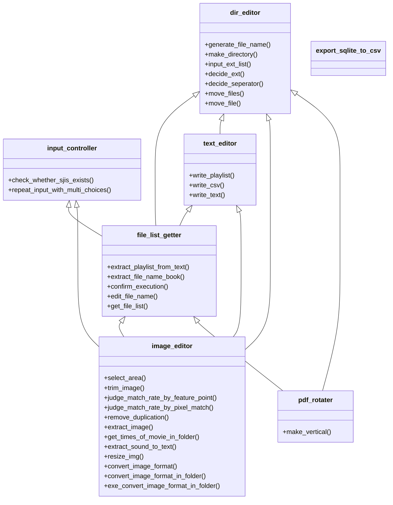

# landmasterlibrarylocal

This repository is for execution at local.

# Modules

1. dir_editor.py
2. export_sqlite_to_csv.py
3. file_list_getter.py
4. image_editor.py
5. input_controller.py
6. pdf_rotater.py
7. text_editor.py

# Functions in each Module

## export_sqlite_to_csv.py

- export_to_csv

## file_list_getter.py

- extract_playlist_from_text
- extract_file_name_book
- confirm_execution
- edit_file_name
- get_file_list
- main

## image_editor.py

- select_area
- update
- trim_image
- judge_match_rate_by_feature_point
- judge_match_rate_by_pixel_match
- remove_duplication
- extract_image
- get_times_of_movie_in_folder
- extract_sound_to_text
- resize_img
- get_statistics
- get_youtube_statistics
- main

## input_controller.py

- check_whether_sjis_exists
- repeat_input_with_multi_choices
- main

## pdf_rotater.py

- make_vertical
- main

## text_editor.py

- write_playlist
- write_csv
- write_text
- main

# Usage by `console_scripts`

<!-- You can use like these by `__name__ == "__main__"`. -->

You can use like these by `console_scripts`.

## dir_editor.py

- write_text

```bash
python dir_editor.py '/Users/landmaster/Downloads/test_folder/test.txt'
```

## 🗄 &nbsp; export_sqlite_to_csv.py

- write_text

```bash
python dir_editor.py '/Users/landmaster/Downloads/test_folder/test.txt'
```

## 🗂 &nbsp; file_list_getter

- extract_playlist_from_text

```bash
python file_list_getter.py '/Users/landmaster/Downloads/test_folder'
```

- extract_file_name_book

```bash
python file_list_getter.py '/Users/landmaster/Downloads/test_folder'
```

- edit_file_name

```bash
python file_list_getter.py '/Users/landmaster/Downloads/test_folder'
```

- get_file_list

```bash
python file_list_getter.py '/Users/landmaster/Downloads/test_folder' 'png'
```

## 🎞 &nbsp; image_editor

- select_area

```bash
python image_editor.py '/Users/landmaster/Downloads/test_folder'
```

- trim_image

```bash
python image_editor.py '/Users/landmaster/Downloads/test_folder' 'jpg'
```

- remove_duplication

```bash
python image_editor.py
```

- extract_image

```bash
python image_editor.py '/Users/landmaster/Downloads/test_folder/test_movie.mp4'
```

## 📑 &nbsp; pdf_rotater

- make_vertical

```bash
python pdf_rotater.py '/Users/landmaster/Downloads/test_folder'
```

## 📝 &nbsp; text_editor

- write_text

```bash
python text_editor.py '/Users/landmaster/Downloads/test_folder/test.txt'
```

***

# Diagram


